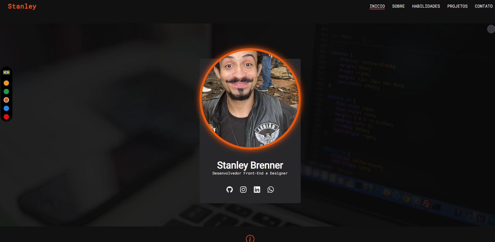

<h1 align="center">Portfólio pessoal de Stanley Brenner</h1>

<h1 align="center">
    <a href="https://stanley-b.vercel.app/">🔗 Clique aqui para acesar meu site!</a>
</h1>

🚀 Portfólio pessoal feito apenas por mim utilizando algumas ferramentas que aprendi com cursos de programação.

Tabela de conteúdos
=================

 <a href="#-objetivo">Objetivo</a> •
 <a href="#-tecnologias">Tecnologias</a> • 
 <a href="#features">Features</a> • 
 <a href="https://github.com/StaanB/EPLAY/blob/main/LICENSE">Licença</a> • 
 <a href="#autor">Autor</a>

<h4 align="center"> 
	🚧 Portóflio 🚀 O projeto sempre está a ser revisado. 🚧
</h4>

### ✅ Objetivo

💡A ideia desse site é demonstrar algumas das minhas habilidades como programador e conhecer a mim mesmo, o site contém meus projetos, meus gostos, minhas habilidades e algumas outras coisas interessantes como 2 idiomas e várias cores como tema!

### 💻 Tecnologias

<h2>Lista de tecnologias utilizadas nesse projeto: </h2>

• NextJS

• ReactJS

• Typescript

• TailwindCSS

• Framer-Motion

• NextJS pagination

• Server Side Rendering

• Static Site Generation

• API

### 💡Features

- [x] Animações.
- [x] Consumo da API do Github.
- [x] Envio de emails configurado.
- [x] 2 idiomas para o site.
- [x] Vários temas para o site.

<h3><a href="https://github.com/StaanB/MEU-PORTFOLIO-NEXTJS/blob/main/LICENSE">⚖️LICENÇA</a></h3>

### 🧑🏻Autor
---

<a href="https://github.com/StaanB">
 
  
 <b>Stanley Brenner</b></a> <a href="https://stanley-b.vercel.app/" title="Stanley">🚀</a>

Feito por Stanley 👋🏽 Entre em contato!

 

